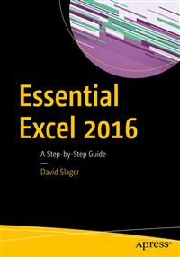

#Apress Source Code

This repository accompanies [*Essential Excel 2016*](http://www.apress.com/9781484221600) by David Slager (Apress, 2016).

Download the files as a zip using the green button, or clone the repository to your machine using Git.

##Releases

Release v1.0 corresponds to the code in the published book, without corrections or updates.

##Contributions

See the file Contributing.md for more information on how you can contribute to this repository.

##A Note from the Author

Thank you for purchasing *Essential Excel 2016*. Microsoft is constantly changing Excel. Some of the information that is in your book can change. I have created a website to keep up with these changes, and questions you may have. Once you have entered a login, you can view the site and enter any questions, problems, or comments.

The website is [http://professoroffice.com/Membership/logonstart.aspx](http://professoroffice.com/Membership/logonstart.aspx).
